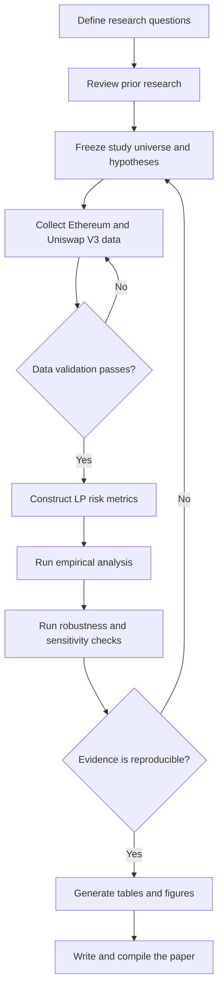

# Research Flow

This document defines the planned workflow for studying Uniswap V3 liquidity
provider risk on Ethereum Mainnet. Each stage produces an auditable output and
must pass its gate before the next dependent stage begins.

Return to the [repository overview](README.md).

## End-to-end workflow

The backward paths are intentional. A validation failure returns to collection,
while a reproducibility or robustness failure may require a revised study design
and a newly versioned analysis rather than an undocumented adjustment.

## Stage definitions

| Stage | Inputs | Required output | Gate to continue |
| --- | --- | --- | --- |
| 1. Research questions | Initial LP risk framework | Bounded questions, primary outcomes, and explicit exclusions | Questions address Ethereum Mainnet Uniswap V3 LPs and can be measured |
| 2. Prior research | Papers, protocol documentation, and empirical methods | Reviewed reference catalog with relevance and limitations | Every adopted concept or method has a traceable source |
| 3. Study design | Questions and prior research | Versioned study period, pool and position filters, benchmarks, hypotheses, and analysis plan | All confirmatory choices are fixed; current values are TBD |
| 4. Data collection | Frozen universe and source plan | Immutable raw extracts plus provenance records | Chain, contracts, block ranges, retrieval time, and source are recorded |
| 5. Data validation | Raw extracts | QA report and validated processed datasets | Completeness, uniqueness, decoding, units, and reconciliation checks pass |
| 6. Metric construction | Validated data and metric definitions | Derived LP P&L, fees, impermanent loss, time-in-range, LVR, and cost measures | Accounting identities and benchmark comparisons pass defined tolerances |
| 7. Empirical analysis | Derived metrics and frozen hypotheses | Descriptive results, model outputs, and diagnostics | Outputs are reproducible from recorded inputs and configuration |
| 8. Robustness checks | Primary results | Sensitivity results for defensible alternative assumptions | Conclusions are labeled by their sensitivity; failures are retained and explained |
| 9. Paper production | Approved evidence and provenance | Generated tables, figures, TeX manuscript, and `paper.pdf` | Every reported claim traces to a reviewed output |

## Stage gates

### 1. Design freeze

Before bulk collection or confirmatory analysis, record the following as a
versioned research decision:

- study start and end blocks or timestamps;
- included pools, fee tiers, tokens, and LP-position rules;
- minimum activity or liquidity thresholds;
- passive-hold and price benchmarks;
- metric formulas, units, sampling frequency, and exclusions;
- hypotheses, model specifications, and planned sensitivity checks.

These values are currently TBD. Exploratory work may inform them, but exploratory
and confirmatory outputs must remain distinguishable.

### 2. Raw-data integrity

Raw data cannot advance when its chain identity, contract identity, block range,
event ordering, or token-unit interpretation is unknown. The validation report
must also document how duplicate records, missing blocks, provider disagreement,
and chain reorganizations were handled.

### 3. Metric reconciliation

Each derived measure must have a written definition and an independent check.
Position cash flows and ending inventory should reconcile to the reported LP
value within a declared numerical tolerance. Gross results must remain available
alongside results net of gas and rebalancing costs.

### 4. Robustness review

Primary findings must be compared with defensible alternatives, including
benchmark choice, time window, pool filters, sampling frequency, outlier policy,
and cost assumptions when relevant. A change in conclusion is a result to report,
not a reason to hide the specification.

### 5. Publication traceability

Every table and figure must identify its generating analysis, input dataset
version, configuration, and repository revision. The manuscript must not contain
manually copied values that cannot be regenerated.

## Failure handling and versioning

- Do not overwrite raw source extracts. Create a new version when recollection is
  required.
- Record failed validation and robustness checks with the reason and resolution.
- Treat a material change to the study universe, metric definition, or hypothesis
  as a new research-design version.
- Keep exploratory results clearly labeled and out of confirmatory claims.
- Stop paper production when a displayed result lacks provenance or cannot be
  reproduced.

Detailed conventions live in the [data methodology](data/), [analysis roadmap](analysis/),
[reference catalog](research-reference/), and [paper plan](paper/).
