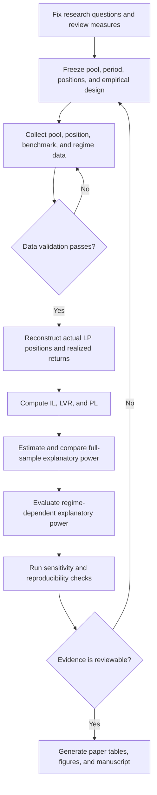

# Research Flow

This document defines the planned workflow for **An Empirical Analysis of
Uniswap V3 LP Risk Measures: Evidence from the WETH/USDT Pool**. Each stage
produces an auditable output and must pass its gate before the next dependent
stage begins.

Return to the [repository overview](README.md).

## End-to-end workflow

The backward paths are intentional. Data failures return to collection, while a
failure in definitions, timing, sensitivity, or reproducibility requires a
versioned design revision rather than an undocumented adjustment.

## Stage definitions

| Stage | Inputs | Required output | Gate to continue |
| --- | --- | --- | --- |
| 1. Research framing | IL, LVR, PL, realized LP return, and prior literature | Two bounded research questions and documented measure concepts | Scope is limited to explanatory power and regime dependence |
| 2. Collection design | Research framing | Fixed-pool snapshot, source/storage plan, and exploratory reconstruction rules | Pool identity, snapshot, budget, and provenance choices are versioned |
| 3. Data collection | Frozen design and source plan | Immutable pool, position, benchmark, and regime extracts plus provenance | Chain, pool, period, source, and retrieval details are recorded |
| 4. Data validation | Raw extracts | QA report and validated processed datasets | Coverage, identity, decoding, units, ordering, and reconciliation checks pass |
| 5. Position reconstruction | Validated data | Actual LP cash flows, inventory, fees, ending values, and realized returns | Position and return accounting identities pass declared tolerances |
| 6. Risk-measure construction | Reconstructed positions and frozen definitions | Position-level IL, LVR, and PL | Each measure passes benchmark, timing, and independent-calculation checks |
| 7. Full-sample analysis | Outcome, measures, and frozen models | Comparable explanatory-power estimates and diagnostics | All measures use the same declared sample, outcome, horizon, and criteria |
| 8. Regime analysis | Primary results and predeclared regimes | Regime-specific relative-importance estimates and diagnostics | Regime assignment is reproducible and free of look-ahead |
| 9. Sensitivity and publication | Primary estimates and alternatives | Sensitivity results, generated tables and figures, and manuscript inputs | Every reported claim traces to a reviewed output |

## Stage gates

### 1. Collection and analysis design freeze

Before bulk collection, record:

- the fixed WETH/USDT 0.05% pool identity, creation block, and data-snapshot cutoff;
- data providers, storage location, finality policy, and numerical integrity checks.

After full-history position EDA and before confirmatory analysis, record:

- the EDA-supported analytical start/end blocks or timestamps;
- actual LP-position inclusion, exclusion, and ownership rules;
- realized-return construction, horizon, valuation convention, and treatment of
  fee income;
- IL, LVR, and PL formulas, benchmarks, units, horizons, and timing;
- candidate regime variables, feature windows, and assignment method;
- model specifications, comparison criteria, and sensitivity checks; and
- numerical tolerances for outcome, measure, and model validation.

Exploratory work may inform these choices, but exploratory and confirmatory
outputs must remain distinguishable.

### 2. Raw-data integrity

Raw data cannot advance when its chain identity, selected pool identity,
declared-interval coverage, event ordering, token-unit interpretation, or
provenance is unknown. The validation report must document duplicates, missing
blocks, provider disagreement, and chain reorganizations.

### 3. Position and measure reconciliation

Actual position cash flows, fee income, inventory, ending value, and realized
return must reconcile under a written accounting identity. IL, LVR, and PL must
each have a frozen definition and an independent check against their declared
benchmark. Range information may enter reconstruction and measure calculations,
but it is not a separate outcome.

### 4. Comparable empirical analysis

The primary comparison must hold the outcome, sample, horizon, and evaluation
criteria constant across IL, LVR, and PL. Regime analysis must use predeclared
features and prevent future data from influencing historical assignments. Gas
fees are a regime variable rather than a standalone transaction-cost study.

### 5. Sensitivity and publication traceability

Primary findings must be evaluated under defensible alternative windows,
definitions, filters, thresholds, and estimators. These checks belong within the
paper's Data and Empirical Design or Empirical Results sections rather than a new
top-level section.

Every table and figure must identify its generating analysis, input dataset
version, configuration, and repository revision. The manuscript must not
contain manually copied values that cannot be regenerated.

## Failure handling and versioning

- Do not overwrite raw source extracts; create a new version when recollection
  is required.
- Record failed validation, diagnostics, and sensitivity checks with their
  reason and resolution.
- Treat a material change to the pool, period, position rules, return, measure,
  regime, or model as a new empirical-design version.
- Keep exploratory results clearly labeled and out of confirmatory claims.
- Stop paper production when a displayed result lacks provenance or cannot be
  reproduced.

Detailed conventions live in the [data methodology](data/), [analysis
roadmap](analysis/), [reference catalog](research-reference/), and [paper
plan](paper/).
